# KeepX - Ứng Dụng Ghi Chú & Quản Lý Công Việc Thông Minh

**KeepX** là giải pháp quản lý cá nhân toàn diện, kết hợp giữa khả năng ghi chú linh hoạt và quản lý tiến độ công việc. Được xây dựng trên sức mạnh của **Django 5** và tốc độ thực của **Google Firebase**, KeepX mang lại trải nghiệm mượt mà, bảo mật và đồng bộ hóa tức thì.

**Light mode**
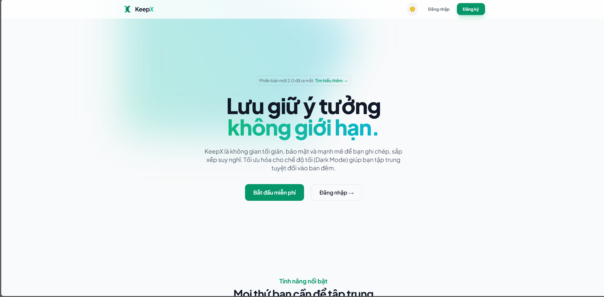
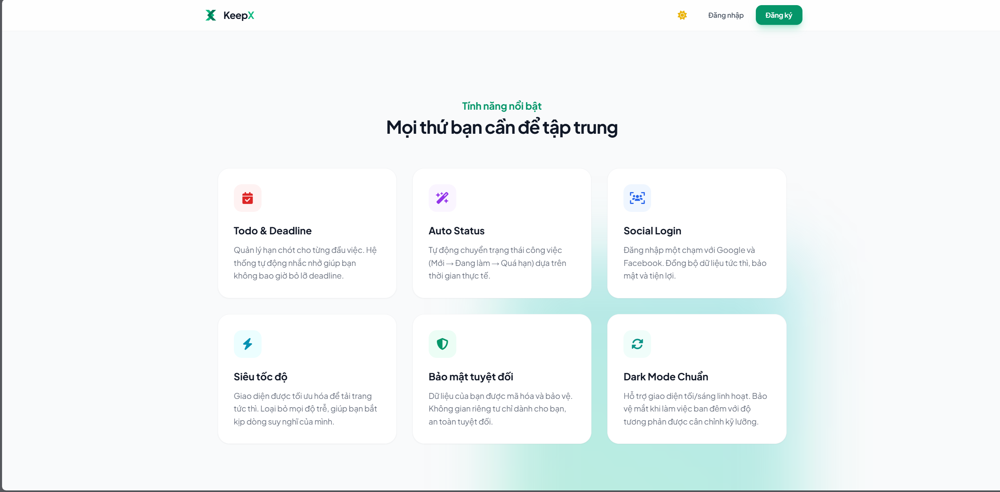

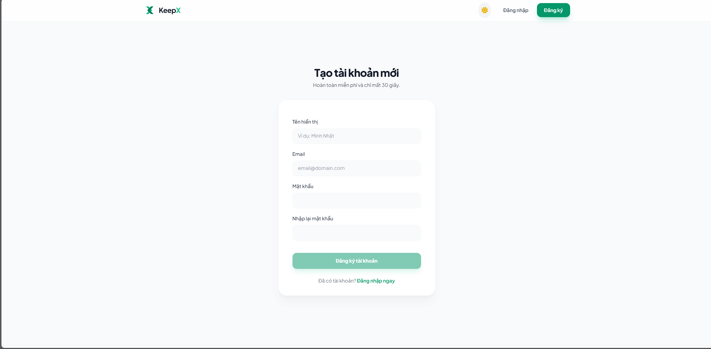
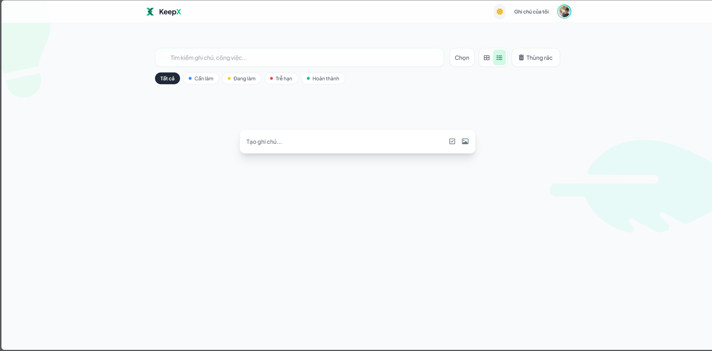
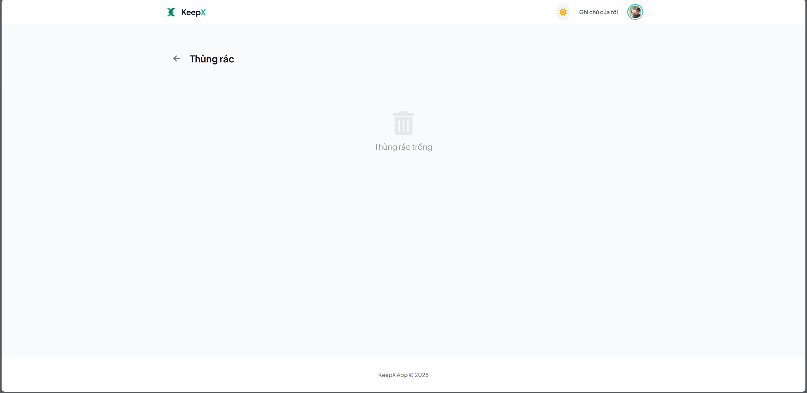
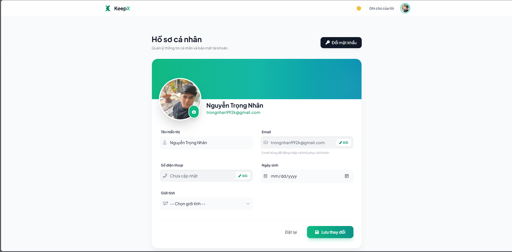

**Dark mode**
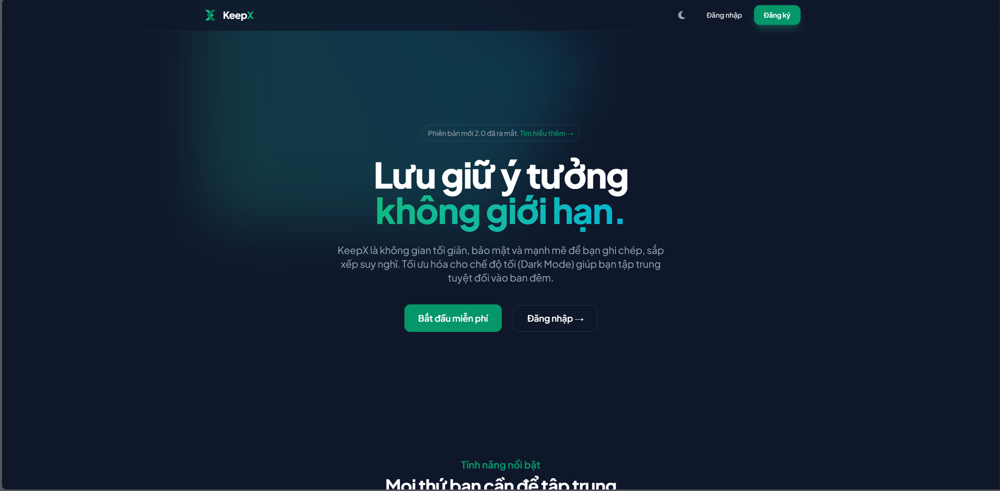
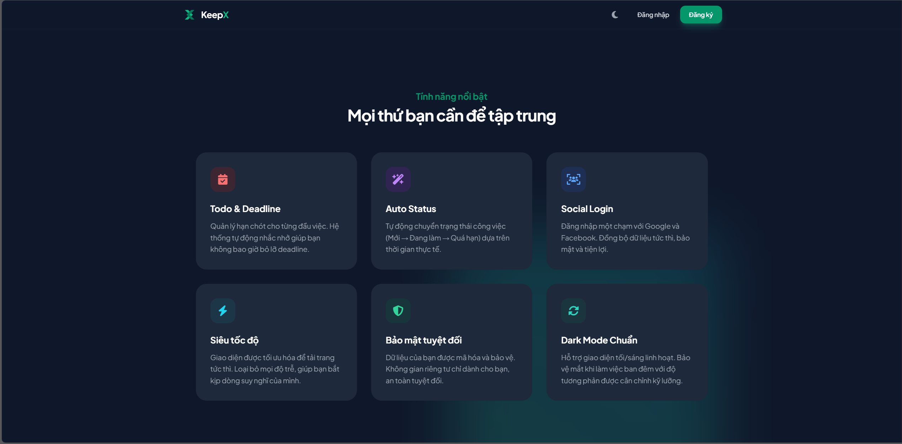
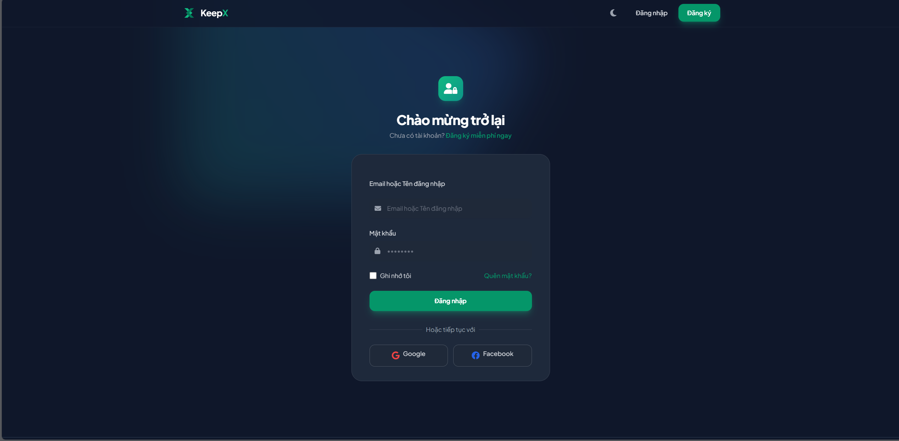
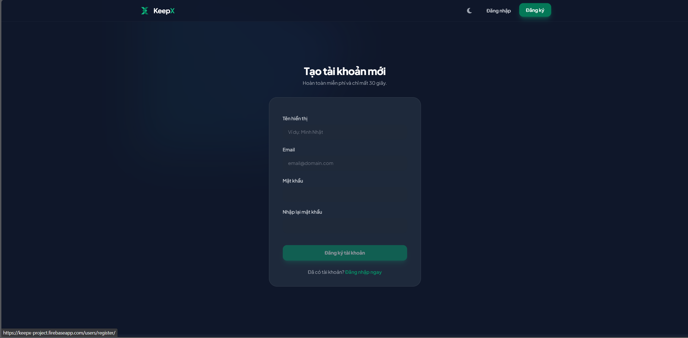
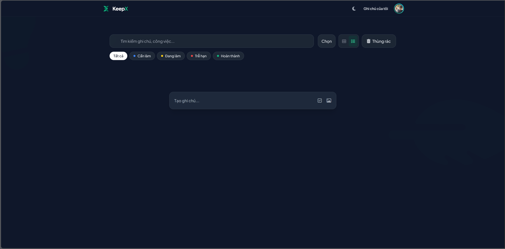
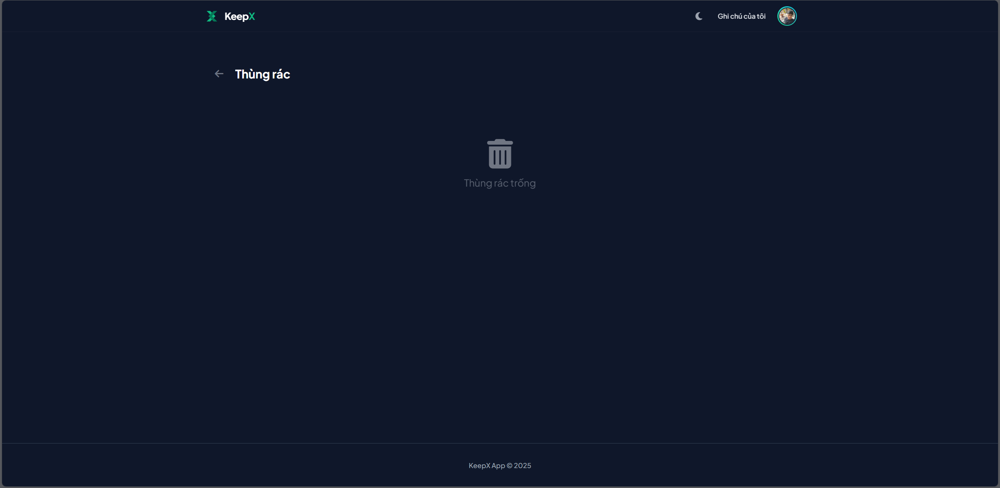
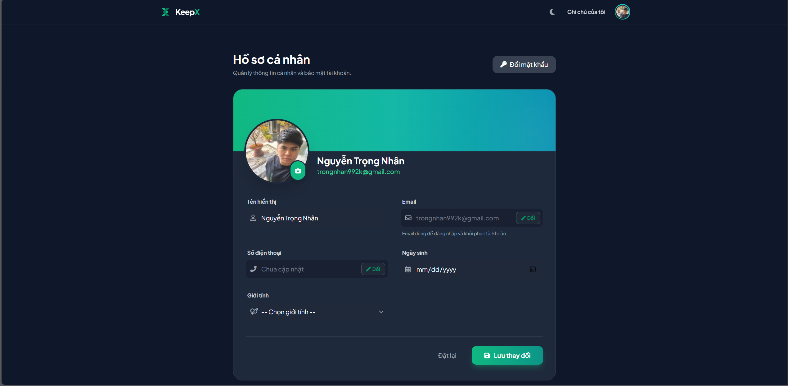

## 🚀 Tính Năng Mới & Nổi Bật

### 📅 Quản Lý Công Việc & Deadline (Mới)

- **Trạng thái công việc:** Phân loại ghi chú theo quy trình: _Cần làm (Todo)_ -> _Đang làm (Doing)_ -> _Hoàn thành (Done)_.
- **Deadline thông minh:** Thiết lập hạn chót cho từng ghi chú.
- **Tự động báo trễ hạn:** Hệ thống tự động kiểm tra và chuyển trạng thái sang **Overdue** (Quá hạn) dựa trên múi giờ Việt Nam (UTC+7) theo thời gian thực.

### ⚡ Thao tác & Hiệu Suất (Mới)

- **Bulk Actions (Thao tác hàng loạt):** Cho phép chọn nhiều ghi chú cùng lúc để Xóa, Khôi phục hoặc Xóa vĩnh viễn chỉ với 1 cú click.
- **Ghim ghi chú (Pin):** Đưa các ghi chú quan trọng lên đầu danh sách.
- **Tìm kiếm & Lọc:** Lọc nhanh theo Nhãn (Labels) hoặc trạng thái.

### 🔐 Xác Thực & Bảo Mật Nâng Cao

- **Đa dạng phương thức đăng nhập:**
  - Email/Password truyền thống.
  - **Social Login:** Hỗ trợ đăng nhập nhanh qua Google/Facebook (xác thực qua Token ID).
- **Bảo vệ tài khoản:** Cơ chế **Re-authentication** (Yêu cầu nhập lại mật khẩu) bắt buộc trước khi thực hiện các thay đổi nhạy cảm như đổi Email, Số điện thoại hoặc Mật khẩu mới.
- **Avatar tự động:** Tự động tạo Avatar dựa trên tên người dùng (UI Avatars) nếu chưa upload ảnh.

### 📝 Các Tính Năng Cốt Lõi

- **Soạn thảo Rich Text:** Hỗ trợ in đậm, nghiêng, danh sách checklist.
- **Đa phương tiện:** Upload và đính kèm hình ảnh trực tiếp lên Firebase Storage.
- **Nhắc nhở (Reminder):** Đặt lịch nhắc nhở cá nhân.
- **Thùng rác an toàn:** Cơ chế "Soft Delete" cho phép khôi phục dữ liệu đã lỡ tay xóa.
- **Chia sẻ & Cộng tác:** Mời bạn bè xem ghi chú qua Email, đồng bộ trạng thái giữa các tài khoản.
- **Giao diện:** Dark Mode/Light Mode tự động, Responsive 100% trên mọi thiết bị.

## 🛠️ Công Nghệ Sử Dụng

Dự án được xây dựng với các phiên bản thư viện mới nhất để đảm bảo hiệu năng và bảo mật:

- **Backend:** Python 3.12+, Django 5.2.8
- **Database:** Google Cloud Firestore (NoSQL Realtime Database)
- **Storage:** Firebase Cloud Storage (Lưu trữ ảnh)
- **Authentication:** Firebase Authentication (Quản lý User & Token)
- **Frontend:**
  - HTML5 / CSS3 / JavaScript
  - **TailwindCSS:** Framework CSS utility-first.
  - **Alpine.js:** Xử lý tương tác UI nhẹ nhàng (Frontend logic).
- **Server/Deployment:** Gunicorn 23.0, Docker, Google Cloud Run.

## ⚙️ Yêu Cầu Tiên Quyết

- [Python 3.10+](https://www.python.org/downloads/)
- [Git](https://git-scm.com/)
- Tài khoản Google Cloud & Project trên [Firebase Console](https://console.firebase.google.com/)

---

## 📥 Hướng Dẫn Cài Đặt & Chạy (Local)

### 1. Clone dự án

bash
git clone [https://github.com/trongnhan992k/KeepX.git](https://github.com/trongnhan992k/KeepX.git)
cd KeepX

### 2. Thiết lập môi trường ảo

bash

# Windows

python -m venv venv
venv\Scripts\activate

# macOS/Linux

python3 -m venv venv
source venv/bin/activate

### 3. Cài đặt thư viện

bash
pip install -r requirements.txt

### 4. 🔑 Cấu Hình Firebase (BẮT BUỘC)

Dự án cần kết nối tới Firebase để hoạt động.

**Bước 4.1: Service Account Key**

1. Truy cập Firebase Console -> Project Settings -> Service accounts.
2. Chọn **Generate new private key**.
3. Đổi tên file tải về thành `serviceAccountKey.json`.
4. Copy file này vào thư mục gốc của dự án (ngang hàng với `manage.py`).

**Bước 4.2: Biến môi trường (.env)**
Tạo file `.env` tại thư mục gốc và điền thông tin:

env

# Lấy trong Project Settings -> General -> Web API Key

FIREBASE_WEB_API_KEY=AIzaSyD...

# Lấy trong Storage -> Copy link bucket (bỏ đoạn "gs://")

FIREBASE_STORAGE_BUCKET=ten-project-cua-ban.firebasestorage.app

# Cấu hình Django

DEBUG=True
SECRET_KEY=django-insecure-your-random-key...

### 5. Chạy ứng dụng

bash
python manage.py runserver

Truy cập: `http://127.0.0.1:8000`

---

## 🐳 Chạy với Docker

1. **Build Image:**
   bash
   docker build -t keepx-app .

2. **Run Container:**
   _Lưu ý: Đảm bảo đã có `serviceAccountKey.json` và `.env` trước khi build/run._
   bash
   docker run -p 8080:8080 --env-file .env keepx-app

Truy cập: `http://localhost:8080`

## 📂 Cấu Trúc Dự Án

KeepX/
├── config/                     # Cấu hình lõi của dự án
│   ├── firebase_setup.py       # Khởi tạo kết nối Firebase Admin SDK
│   ├── settings.py             # Cài đặt Django (Biến môi trường, Apps, Middleware)
│   ├── urls.py                 # Định tuyến URL gốc
│   ├── asgi.py                 # Cấu hình ASGI (Asynchronous)
│   └── wsgi.py                 # Cấu hình WSGI (Triển khai Gunicorn)
├── notes/                      # App: Quản lý Ghi chú & Công việc
│   ├── forms.py                # Các Form xử lý dữ liệu ghi chú
│   ├── urls.py                 # Định tuyến URL nội bộ cho notes
│   ├── views.py                # Logic chính: CRUD, Upload ảnh, Deadline, Ghim
│   └── templates/notes/        # Giao diện riêng của Notes
│       ├── note_form.html      # Form thêm/sửa ghi chú
│       ├── note_list.html      # Danh sách ghi chú & công việc
│       └── trash.html          # Thùng rác
├── users/                      # App: Quản lý Người dùng & Xác thực
│   ├── forms.py                # Form đăng ký, đăng nhập, đổi mật khẩu
│   ├── urls.py                 # Định tuyến URL nội bộ cho users
│   ├── views.py                # Logic Auth, Profile, Social Login, Bảo mật
│   └── templates/users/        # Giao diện Authentication & Profile
│       ├── login.html          # Đăng nhập
│       ├── register.html       # Đăng ký
│       ├── profile.html        # Thông tin cá nhân
│       ├── verify_security.html# Xác thực lại mật khẩu (Re-auth)
│       └── ...                 # Các file hỗ trợ đổi mật khẩu/email
├── static/                     # Tài nguyên tĩnh (CSS, JS, Images gốc)
│   ├── css/style.css           # Tailwind directives & Custom CSS
│   ├── js/app.js               # Logic Frontend (Alpine.js)
│   └── images/                 # Logo & assets
├── templates/                  # Giao diện chung (Global Templates)
│   ├── base.html               # Layout chính (Header, Footer, Sidebar)
│   └── index.html              # Trang chủ (Landing page)
├── deploy.sh                   # Script triển khai (Shell)
├── deploy.ps1                  # Script triển khai (PowerShell)
├── Dockerfile                  # Cấu hình đóng gói Docker image
├── manage.py                   # Trình quản lý Django CLI
├── requirements.txt            # Danh sách thư viện Python
└── serviceAccountKey.json      # (Không commit) Key bảo mật Firebase

## 🤝 Đóng Góp (Contributing)

1. Fork dự án.
2. Tạo nhánh tính năng (`git checkout -b feature/TinhNangMoi`).
3. Commit thay đổi (`git commit -m 'Thêm tính năng X'`).
4. Push lên nhánh (`git push origin feature/TinhNangMoi`).
5. Tạo Pull Request.

## 📄 License

Dự án được phát hành dưới giấy phép MIT.

Developed with ❤️ by **TrongNhan992k**
